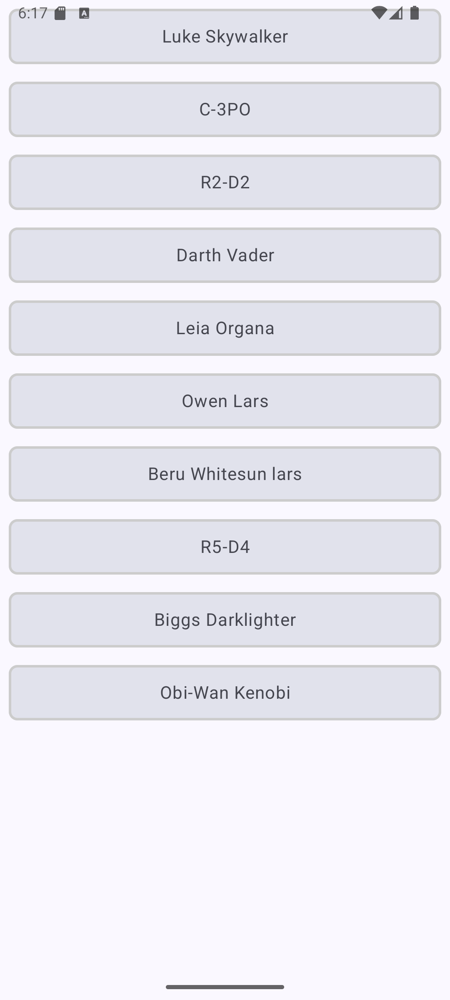

# Android App with Retrofit LiveData and MVVM
## Android Studio Version
Android Studio Ladybug | 2024.2.1 Patch 2

## Language
Kotlin with JetPack Compose

## Purpose
This app is a demo of the use of **Retrofit** for accessing API REST using **MVVM** paradigm and **LiveData**.

---

# Gradle dependencies
It is necessary to add the following dependencies in the file [`app/build.gradle.kts`](app/build.gradle.kts) (Module :app) level:

``` bash
   //LIVEDATA
    implementation("androidx.compose.runtime:runtime-livedata:1.7.5")
    //RETROFIT
    implementation ("com.squareup.retrofit2:retrofit:2.9.0")
    implementation ("com.squareup.retrofit2:converter-gson:2.9.0")
    implementation ("com.squareup.okhttp3:logging-interceptor:4.9.3")
    //CORRUTINES
    implementation("org.jetbrains.kotlinx:kotlinx-coroutines-android:1.7.3")
    //GLIDE
    implementation("com.github.bumptech.glide:compose:1.0.0-beta01")
    testImplementation("junit:junit:4.13.2")
    //TESTS
    testImplementation("io.mockk:mockk:1.12.2")
    androidTestImplementation("androidx.test.ext:junit:1.2.1")
    androidTestImplementation("androidx.test.espresso:espresso-core:3.6.1")
    androidTestImplementation(platform("androidx.compose:compose-bom:2024.10.01"))
    androidTestImplementation("androidx.compose.ui:ui-test-junit4")
    debugImplementation("androidx.compose.ui:ui-tooling")
    debugImplementation("androidx.compose.ui:ui-test-manifest")
```

# AndroidManifest.xml
It is necessary to add Internet access permissions in [AndroidManifest.xml](app/src/main/AndroidManifest.xml) file:

``` bash
  <uses-permission android:name="android.permission.INTERNET"/>
```

# Screenshot


---
# References
- **APIREST credits**: [https://swapi.dev/documentation](https://swapi.dev/documentation)
